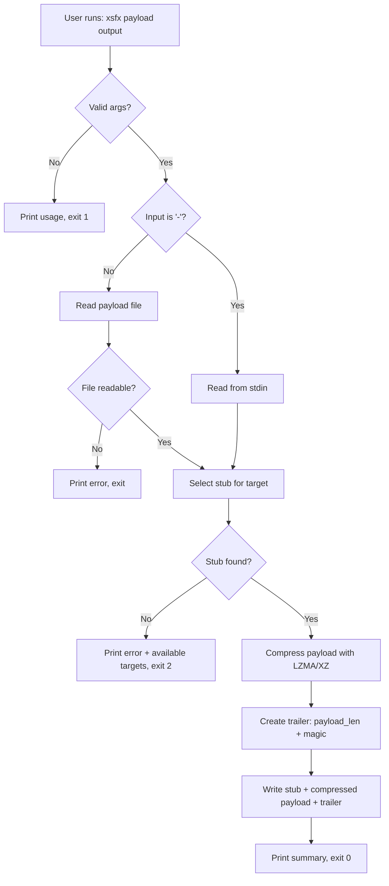
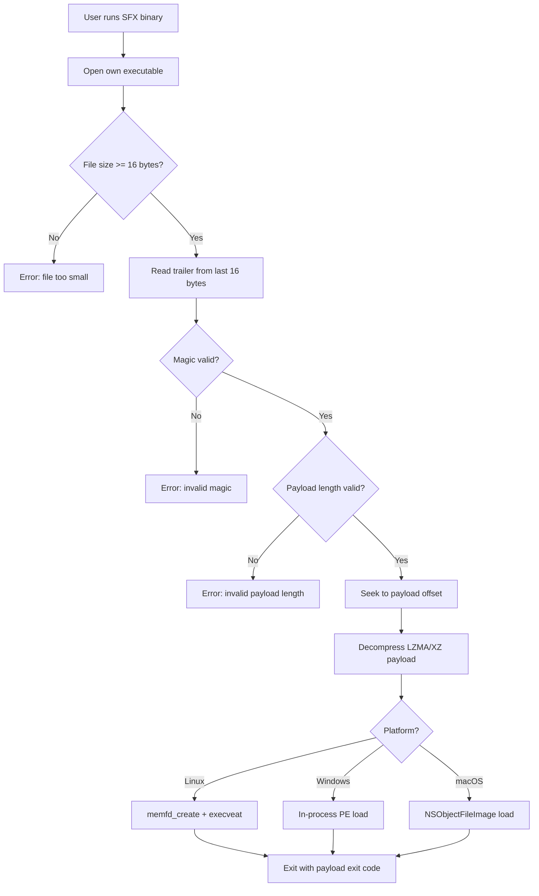
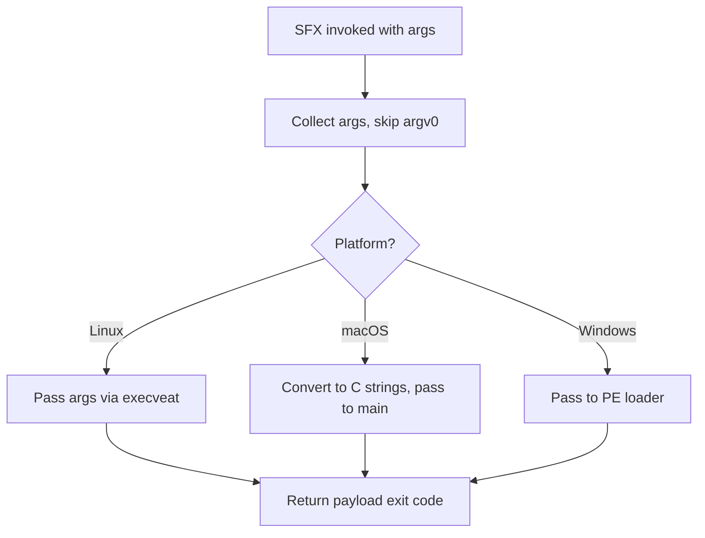

# xsfx — Specification

**Version:** 0.2.0

## 1. What the System Does

xsfx is a self-extracting executable (SFX) packer written in Rust. It compresses a payload binary using LZMA/XZ and bundles it with a small per-platform stub. The resulting SFX executable decompresses and runs the payload entirely in memory at runtime — no temporary files are written on any platform.

## 2. What the System Solves (Business Values)

- **Single-binary distribution:** Combine a stub and payload into one executable for simplified deployment.
- **Cross-platform:** Supports 9 target platforms across Linux, macOS, and Windows (x64 and ARM64).
- **.NET compatibility:** Does not modify PE headers, unlike UPX — preserves .NET assembly validity.
- **Minimal runtime dependencies:** Stub uses pure-Rust lzma-rs for decompression (only libc for Linux memfd syscalls).
- **Fileless execution:** Uses `memfd_create` (Linux), in-process PE loading (Windows), `NSCreateObjectFileImageFromMemory` (macOS) — zero temp files on all platforms.
- **Ultra compression:** LZMA2 extreme preset 9 with 64 MiB dictionary via statically linked liblzma — typically ~55% size reduction.

## 3. How the System Does It (Architecture)

### 3.1 Components

| Component | Binary    | Description                                        |
|-----------|-----------|----------------------------------------------------|
| Packer    | `xsfx`    | CLI: reads payload, compresses, produces SFX       |
| Stub      | `stub`    | Embedded runtime: extracts and executes payload     |
| Library   | `libxsfx` | Shared types (Trailer), compress, decompress funcs  |

### 3.2 SFX Binary Format

```text
+------------------------+
| Stub binary            |  (embedded at build time via include_bytes!)
+------------------------+
| Compressed payload     |  (LZMA/XZ stream)
+------------------------+
| Trailer (16 bytes)     |  payload_len (u64 LE) + magic (u64 LE)
+------------------------+
```

### 3.3 Build-time Embedding (Multi-Stub Catalog)

A `build.rs` script compiles stubs for each target platform and generates a `stub_catalog.rs` containing `include_bytes!` for each. The packer embeds all stubs and selects the right one at pack time via `--target <triple>`. Each packer binary can produce SFX executables for any embedded target.

### 3.4 Supported Targets

| Target | Arch | Execution Method |
|--------|------|------------------|
| `x86_64-unknown-linux-gnu` | x64 | `memfd_create` + `execveat` |
| `aarch64-unknown-linux-gnu` | ARM64 | `memfd_create` + `execveat` |
| `x86_64-unknown-linux-musl` | x64 | `memfd_create` + `execveat` |
| `aarch64-unknown-linux-musl` | ARM64 | `memfd_create` + `execveat` |
| `x86_64-apple-darwin` | x64 | `NSCreateObjectFileImageFromMemory` |
| `aarch64-apple-darwin` | ARM64 | `NSCreateObjectFileImageFromMemory` |
| `x86_64-pc-windows-gnu` | x64 | In-process PE loader |
| `x86_64-pc-windows-msvc` | x64 | In-process PE loader |
| `aarch64-pc-windows-msvc` | ARM64 | In-process PE loader |

---

## 4. Use Cases

### UC-001: Pack an Executable

**Summary:** User packs a payload binary into a self-extracting executable.

**Description:** The user invokes `xsfx <payload_path> <output_sfx> [--target <triple>]`. The packer reads the payload, compresses it with LZMA/XZ, selects the stub for the requested target from its embedded catalog, prepends the stub, appends a 16-byte trailer, and writes the SFX to the output path.

**Related BR/WF:** BR-001, BR-002, BR-003, BR-004, BR-014, WF-001

#### Functional Requirements

- The packer MUST accept 2 positional arguments: `<payload> <output>`, plus an optional `--target <triple>` flag
- If `<payload>` is `-`, read payload from stdin instead of a file
- If `<output>` is `-`, write SFX binary to stdout instead of a file; suppress the summary line to avoid corrupting the binary stream
- On wrong argument count, print usage to stderr and exit with code 1
- The payload file MUST be readable; on failure, print `"Failed to read payload {path}: {error}"` and exit
- The output file MUST be writable; on failure, print `"Failed to create output {path}: {error}"` and exit
- The packer MUST compress the payload using LZMA/XZ (BR-003, BR-004, BR-014)
- The packer MUST assemble SFX as `[stub][compressed payload][trailer]` (BR-001, BR-002)
- If `--target` is specified, select the matching stub from the embedded catalog; if not found, print `"Requested target '{triple}' not available in this build."`, list available targets, and exit with code 2
- If `--target` is not specified, use the default target (env `XSFX_OUT_TARGET` or build-time default)
- On success (file output), print summary to stderr and exit 0
- On success (stdout output), exit 0 silently (summary suppressed to avoid corrupting binary stream)

**Flow (Mermaid):**



**Baseline screenshots:** N/A (CLI tool, no UI)

---

### UC-002: Execute a Packed SFX

**Summary:** A packed SFX binary self-extracts and runs its embedded payload in memory.

**Description:** The stub reads the 16-byte trailer from the end of its own executable. It validates the magic marker, reads the compressed payload, decompresses it, and executes it in-memory using a platform-specific strategy: `memfd_create` + `execveat` on Linux, in-process PE loading on Windows, `NSCreateObjectFileImageFromMemory` on macOS. No temp files are used on any platform. On Linux, the stub opens itself via `/proc/self/exe` directly so it works both from disk and from a memfd (two-stage SFX, see BR-015).

**Related BR/WF:** BR-001, BR-002, BR-005, BR-006, BR-008, BR-009, BR-010, BR-011, BR-012, BR-015, WF-002

#### Functional Requirements

- The stub MUST read the last 16 bytes of its own executable as the trailer (BR-002)
- The trailer magic MUST be validated against `0x5346584C5A4D4121`; reject with `"Invalid SFX magic marker"` if invalid
- The payload length MUST be validated: `payload_len > 0` and `payload_len <= total_file_size - TRAILER_SIZE`; reject with `"Invalid payload length in trailer"` if invalid
- The file MUST be at least 16 bytes; reject with `"File too small to contain trailer"` otherwise
- The stub MUST decompress the payload using pure-Rust lzma-rs (BR-005)
- Execution MUST use platform-specific in-memory strategy with zero temp files:
  - **Linux:** open `/proc/self/exe`, create anonymous memfd via `memfd_create("rsfx", MFD_CLOEXEC)`, write decompressed payload, set permissions 0o700, execute via `execveat(fd, "", argv, envp, AT_EMPTY_PATH)` (BR-006)
  - **Windows:** parse PE headers, allocate memory via `VirtualAlloc`, map sections, process relocations, resolve imports via `LoadLibraryA`/`GetProcAddress`, set section protections, flush instruction cache, call entry point (BR-011)
  - **macOS:** validate Mach-O magic (`0xFEEDFACF`), patch `MH_EXECUTE` to `MH_BUNDLE`, create object file image via `NSCreateObjectFileImageFromMemory`, link module, look up `_main` symbol, call as C function (BR-012)
- On error, print `"SFX stub error"` to stderr and exit with code 1
- On success, exit with the payload's exit code
- Failure modes (user-visible):
  - `"File too small to contain trailer"`
  - `"Invalid SFX magic marker"`
  - `"Invalid payload length in trailer"`
  - Decompression failure: LZMA error propagated
  - Linux: OS error from `memfd_create` or `execveat`
  - Windows: `"VirtualAlloc failed"`, `"Failed to load DLL"`, `"Failed to resolve import"`, `"VirtualProtect failed"`, PE header validation errors
  - macOS: `"Failed to create object file image"`, `"Failed to link module"`, `"Failed to find _main symbol"`, `"Failed to get address of _main"`, Mach-O validation errors

**Flow (Mermaid):**



**Baseline screenshots:** N/A (CLI tool, no UI)

---

### UC-003: Forward CLI Arguments

**Summary:** CLI arguments passed to the SFX are forwarded to the payload.

**Description:** All arguments except argv[0] are collected and forwarded to the payload process. On Linux, argv and environment are passed via `execveat` directly. On macOS, arguments are converted to C strings and passed to the payload's `main(argc, argv)`. On Windows, arguments are passed to the PE loader (currently unused by the in-process loader).

**Related BR/WF:** BR-008, BR-009, WF-002

#### Functional Requirements

- All CLI arguments except argv[0] MUST be forwarded to the payload process
- On Linux, argv[0] is not separately controlled — `execveat` with `AT_EMPTY_PATH` sets it from the fd path
- On macOS, arguments are converted to null-terminated C strings and passed as `argc`/`argv` to the payload's `_main` function
- The SFX MUST return the payload's exit code
- Failure mode: payload fails to start — OS error propagated to stderr

**Flow (Mermaid):**



**Baseline screenshots:** N/A (CLI tool, no UI)

---

## 5. Business Rules

### BR-001: SFX Binary Format

The SFX binary MUST be: `[stub][compressed payload][trailer]`. The trailer is always the last 16 bytes.

### BR-002: Trailer Format

Exactly 16 bytes: `payload_len` (u64 LE) + `magic` (u64 LE). Magic MUST be `0x5346584C5A4D4121` ("SFXLZMA!").

### BR-003: Compression Format

Payloads MUST use XZ/LZMA format, decompressible by lzma-rs `xz_decompress`.

### BR-004: Compression Implementation Selection

The packer uses liblzma (statically linked from vendored source via xz2 with the `static` feature) for ultra compression by default (see BR-014). A pure-Rust fallback (lzma-rs, standard settings) is available via `--no-default-features`.

### BR-005: Decompression Implementation

The stub MUST always use pure-Rust lzma-rs for decompression (zero native deps in the stub).

### BR-006: Linux In-Memory Execution

On Linux, the stub MUST use `memfd_create` (MFD_CLOEXEC) to hold the decompressed payload, then execute it via `execveat(fd, "", argv, envp, AT_EMPTY_PATH)`. This replaces the current process entirely. No fork, no temp files.

The stub MUST open its own executable via `/proc/self/exe` directly (not by resolving the symlink path with `current_exe()`). When the stub runs from a memfd (e.g. two-stage SFX), `readlink("/proc/self/exe")` returns a virtual path like `/memfd:s (deleted)` that cannot be opened via the filesystem. Opening `/proc/self/exe` as a file works because the kernel follows the symlink to the underlying file descriptor.

### BR-007: Reserved

(Removed — temp files eliminated on all platforms.)

### BR-008: Argument Forwarding

All CLI args except argv[0] MUST be forwarded to the payload.

### BR-009: argv[0] Preservation

On Linux, argv[0] is inherited from the `execveat` call. On macOS, the original args are passed to `_main(argc, argv)`.

### BR-010: Static Linking Policy

All stub binaries MUST be statically linked:
- Linux musl: `-C target-feature=+crt-static` with the system linker (not `musl-gcc` or zig for the stub itself — Rust's built-in musl support produces correct static-pie binaries)
- Windows: `-C target-feature=+crt-static`
- macOS: system frameworks (statically linked by default)

### BR-011: Windows In-Memory PE Execution

On Windows, the stub MUST load the PE payload in-process: parse PE headers, allocate memory via `VirtualAlloc`, map sections, process relocations (`IMAGE_REL_BASED_DIR64`), resolve imports via `LoadLibraryA`/`GetProcAddress`, set section protections, flush instruction cache, and call the entry point. No temp files, no child processes. Only PE32+ (64-bit x64) images are supported.

### BR-012: macOS In-Memory Mach-O Execution

On macOS, the stub MUST load the Mach-O payload via `NSCreateObjectFileImageFromMemory`: patch `MH_EXECUTE` to `MH_BUNDLE`, create object file image, link module with `NSLINKMODULE_OPTION_PRIVATE`, look up `_main` symbol, and call it. No temp files. Only 64-bit Mach-O (`MH_MAGIC_64 = 0xFEEDFACF`) is supported.

### BR-013: Stub Size Budget

All stub binaries MUST be < 100 KB after post-build processing. The build pipeline uses nightly Rust with `-Z build-std=std,panic_abort` and `-Cpanic=immediate-abort` to minimize std footprint, followed by UPX `--best --lzma` compression for supported targets. UPX is skipped for `*-linux-musl` stubs because UPX's in-process decompression preserves a stale `AT_BASE` in the auxiliary vector, causing musl's startup to exit 127. For musl stubs, `xstrip` is applied for ELF-level dead code removal.

### BR-014: Ultra Payload Compression

The packer MUST use LZMA2 ultra compression by default (enabled via the `native-compress` feature, on by default): extreme preset 9 (`9 | 1<<31`), 64 MiB dictionary (capped to input size, min 4 KiB), BinaryTree4 match finder, nice_len=273, CRC-64 check. No BCJ pre-filter — lzma-rs (used by the stub) only supports the LZMA2 filter (ID 0x21). liblzma is statically linked from vendored source — no system `liblzma-dev` required.

### BR-015: Two-Stage SFX Format (musl)

For `*-linux-musl` targets, the SFX MAY use a two-stage format to reduce total size:

```text
+-----------------------------+
| stage0 loader (~10 KB)      |  nostd, raw syscalls, custom inflate
+-----------------------------+
| deflate(stage1_sfx)         |  deflate-compressed traditional SFX
+-----------------------------+
| stage0 trailer (24 bytes)   |  compressed_len + uncompressed_len + magic
+-----------------------------+
```

Stage0 is a `#![no_std]` `#![no_main]` Rust binary with zero dependencies, raw x86_64 Linux syscalls via inline assembly, and a custom RFC 1951 inflate implementation. Stage0 trailer magic: `0x5346585F53543021` ("SFX_ST0!"). Stage1 is the standard SFX (BR-001). This achieves ~40% size reduction for musl targets.

---

## 6. Workflows

### WF-001: Packing Workflow

1. Parse CLI arguments (payload path, output path, optional `--target`)
2. Select stub from embedded catalog for the requested target
3. Read payload file
4. Compress payload (BR-003, BR-004, BR-014)
5. Create trailer (BR-002)
6. Write stub + compressed payload + trailer (BR-001)
7. Print summary

### WF-002: Extraction/Execution Workflow

1. Open own executable via `/proc/self/exe` (Linux) or `current_exe()` (other)
2. Read trailer from last 16 bytes (BR-002)
3. Validate magic marker
4. Validate payload length against file size
5. Seek to payload start offset
6. Decompress payload (BR-003, BR-005)
7. Execute payload in-memory (BR-006, BR-011, BR-012)
8. Forward CLI arguments (BR-008, BR-009)
9. Exit with payload's exit code
